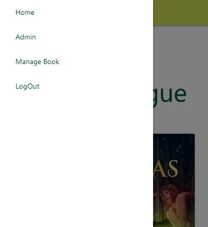

# Borrow A Story!
[View the live project here](https://borrow-a-story.herokuapp.com/)

## Introduction
"Borrow a Story" is a website for a public library, which catalogues all its collection online. A visitor to the library can easily access the website and find out books they would be interested in, read the summary, look-up the shelf they can find it on and borrow it via the website only. All it takes is creting their account, which takes just a minute and they can be exploring the world of stories and information with the click of a button!

## Table of Content
 -  [UX/UI](#ux)
    - [Site Purpose](#purpose])
    - [Scope](#scope)
    - [Target Audience](#audience)
    - [User Stories](#stories)
        1. [As an Admin](#admin)
        1. [As a User](#user)
    - [Design](#design)
        1. [Framework](#framework)
        1. [Schemas](#schemas)
        1. [Color](#color)
        1. [Imagery](#imagery)
 - [Features](#features)
    - [Present Features](#present)
        1. [Navbar](#nav)
        1. [Home Page](#home)
        1. [Sign-up/Sign-in/Sign-out](#sign)
        1. [Borrow Book](#borrow)
        1. [Return Book](#return)
        1. [Profile Page](#profile)
    - [Future Features](#future)
 - [Testing and Bug Fixes](#testing)
 - [Technologies and Libraries Used](#tech)
    1. [Main Language Used](#language)
    1. [Python Library and API used](#api)
    1. [Data Storage](#storage)
 - [Development and Deployment](#deployment)
 - [Credits and Acknowledgement](#credits)

# UX/UI 
## Site Purpose 
The purpose of this website is to provide a platform for both, the Library staff and the Library patrons, where they can access their desired objectives. A library staff can efficiently and convinently catalogue books available at the library, look-up the status of books whether it's available or has been borrowed by a library patron, and manage the patron's information.
On the other hand, a library patron/user can convinently find the books they might be interested in, find the location in the library where the book is kept, and if available, borrow it easily via the website itself. 

## Site Objectives
1. Provide an appealing and user friendly website.
1. Provide effective database maangement tools to the staffs.
1. Provide ease-of-navigation throughout the website.
1. Encourage more people to visit library by coalescing digital media with print media.

## Target Audience
1. Regular visitors to the library.
1. Reluctant visitors who wants to avoid the hassle of going to the counter and getting a book issued.
1. Youngsters who are more comfortable with digital platforms.
1. For every book lover out there.
1. For everyone who wants to try out the public library.

## User Story
 ### As An Admin
   - I can add and update new books to the catalogue.
   - I can view the complete borrow history of each book.
   - I can check which books are currently borrowed by which user.
   - I can check the return status of each book.

 ### As a User
   - I can register easily.
   - I can check the book catalogue and where it is located in the library.
   - I can read the book summary and borrow it easily.
   - I can bookmark my favorite books to view them later.

## Design  
 ### Framework   
 
   #### Homepage:  
 
   

   #### Book Issue/Return Page:  
 
  

   #### Profile Page:  
 
   

## Database Schemas  

## Color  
The color pallets have been selected form the MaterializeCSS's library and are used to appropriately brighten the website and entice the users.
  

## Typography  
The fonts used in the website are the standard fonts provided by MaterializeCSS framework, which is Roboto 2.0

# Features

## Present Features

### Navbar
The navbar is convinently constructed to display the website name, clicking on which will take you to the homepage. It also displays the links depending on the user viewing the website. If it's a new user, it will display the log-in and sign-up links, if the user is logged in, it will display the profile and log-out links, and to an admin, it will display the 'admin' link instead of the profile link, so that the admin can easily access the database.
The navbar is also customised to wrap all the links into a burger menu for small-screen devices.
 

Nav-bar as seen by a logged-out user:

 

Nav-bar as seen by a logged-in user:

 

Nav-bar as seen by an admin:

 

Burger Menu:

  

### Homepage
The hompage displays the catalogue of all the books at the library, and is paginated to show 9 books per page. The book information such as the title, author name, published year and the shelf it is kept on are all contained within the cards. The book-cards are also customised. If the user is logged-out, it'll ask them to log-in to see the detail. To a logged-in user, it'll show either of three options: Borrow, Return or Not-Availabe depending on the status of the book. This card also has the bookmark icon, which the user can interact with and bookmark them.
  

Homepage as seen by a logged-out user:

  

Homepage as seen by a logged-in user:

### Book Borrow/Return Page
Upon clicking Borrow/Return button, the user is redirected to a new page where the user can read a brief summary of the book, and if they want to borrow it, they can just put in the date they are willing to return the book and borrow it directly. For returning, the same can be done, by just clicking the Return button, the databse will record the book as returned by the user.
 

 

### Book Issued/Returned Confirmation Page
After borrowing/returning the book, the user is redirected to the confirmation page, which displays the confirmation message and, also, at the bottom shows a collection of few books from the catalogue which the user might be interested in. Hence, encouraging them to explore more and read more books.
  

Book Borrowed Confirmation:

  

Book Returned Confirmation:

  

Selection of Books from the Catalogue the User Might Be Interested In:

  

### Profile
The profile page displays the basic information of the user provided while registering, like user_name and e-mail address. It also has a section for contact information, which the user can fill, like address and phone number. This information is handled by the django's form element to update the database.

This page also displays the books which has been borrowed by the user and the books bookmarked by them.
  

Bio Section: 

  

Borrowed Books Section: 

  

Bookmarks: 

### Sign-up/ Log-in/ Log-out
The website's user authentication is taken care by the django-allauth service.
 

Sign-up page: 

  

Sign-in page: 

  

Sign-out page: 

## Features to Implement
In the future, given more time to work on the website, I would like to implement the following features:
- Book Search feature on the homepage.
- Return/Explore buttons on the book catalogue on user's Profile page.